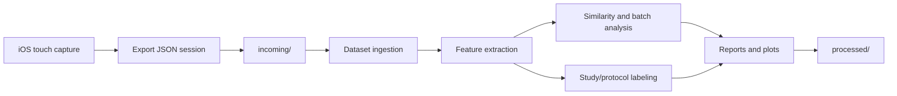

# Architecture Guide

This document explains how the main subsystems fit together.

## High-level flow

## iOS acquisition layer

The UIKit app captures raw touch events and writes structured session JSON.

Key responsibilities:

- record low-level touch samples
- preserve timestamps and per-touch grouping
- capture coalesced and predicted touch samples where available
- attach session, protocol, trial, and study metadata
- export a JSON file that can be ingested later by Python

Important files:

- `TGRV/TouchCaptureViewController.swift`
- `TGRV/TouchLogger.swift`
- `TGRV/TouchEvent.swift`
- `TGRV/SessionManager.swift`
- `TGRV/ExportManager.swift`

## Ingestion and dataset layer

The analyzer watches `incoming/`, imports new JSON files, deduplicates them, and organizes them into the dataset tree.

Responsibilities:

- parse session JSON
- persist organized session copies
- maintain import indexes and manifests
- attach protocol and study metadata
- load session records for analysis and UI display

Important files:

- `touchprint_lab/analyzer/dataset.py`
- `touchprint_lab/analyzer/models.py`
- `touchprint_lab/analyzer/ingest.py`
- `touchprint_lab/utils/paths.py`
- `touchprint_lab/utils/hash.py`

## Feature extraction layer

Raw sessions are converted into interpretable feature vectors.

Feature families:

- temporal
- spatial
- pressure/contact
- micro-dynamic
- session-level summary metrics

Important files:

- `touchprint_lab/analyzer/features.py`
- `touchprint_lab/analyzer/analysis.py`

## Similarity and validation layer

This layer compares sessions and evaluates whether same-user vectors are more similar than cross-user vectors.

Responsibilities:

- cosine similarity
- Euclidean distance
- normalized similarity scoring
- pairwise matrices
- batch statistics
- ROC-style separation previews
- feature importance inspection

Important files:

- `touchprint_lab/analyzer/similarity.py`
- `touchprint_lab/analyzer/batch.py`

## Protocol and study orchestration layer

This layer defines controlled experiments, trial labeling, pacing, and study templates.

Responsibilities:

- create experiment runs
- manage trial lifecycle
- attach protocol metadata to sessions
- define reusable study templates
- generate deterministic schedules
- track longitudinal studies and repeatability

Important files:

- `touchprint_lab/analyzer/protocols.py`
- `touchprint_lab/analyzer/studies.py`

## UI layer

The PyQt6 app provides the operator interface for inspection and orchestration.

Panels include:

- feature inspection
- batch analysis
- experiment protocol control
- study library and templates
- session metadata and plots

Important files:

- `touchprint_lab/ui/main_window.py`
- `touchprint_lab/ui/feature_inspector.py`
- `touchprint_lab/ui/batch_analysis.py`
- `touchprint_lab/ui/protocol_orchestrator.py`
- `touchprint_lab/ui/study_library.py`

## Output directories

Generated state is written under `touchprint_lab/processed/`:

- `features/` — per-session feature vectors
- `protocols/` — active protocol state and protocol reports
- `studies/` — active study state, templates, and study reports
- `reports/` — batch analysis and statistical validation outputs

